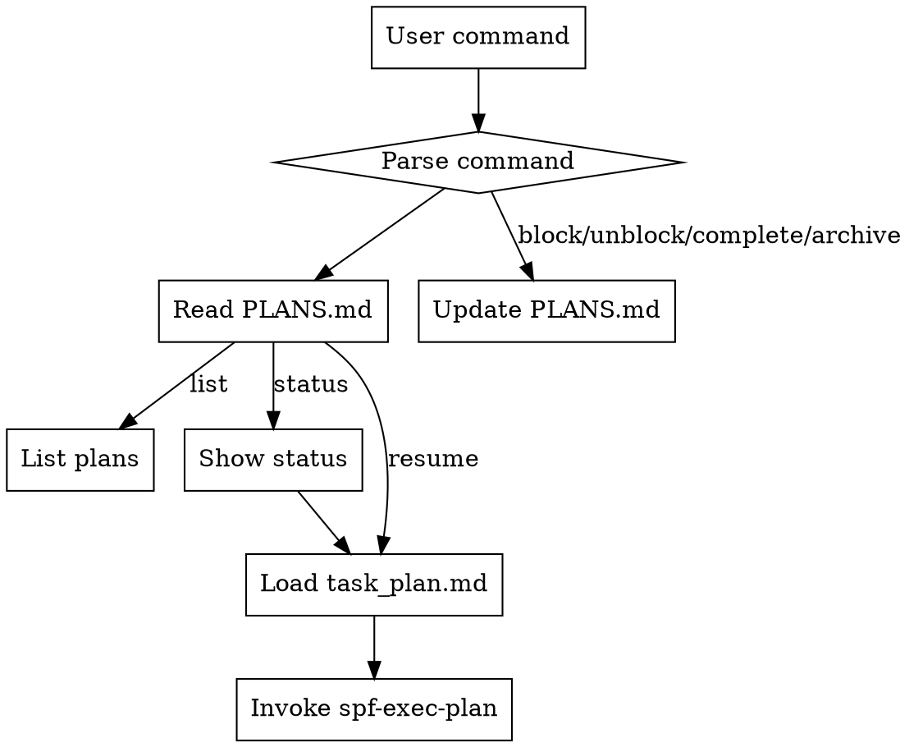

# SPF Plan Manager

## Overview

Manage SPF plans across all projects. List, status check, resume, and archive plans via simple commands.

## When to Use

- User asks "show me my plans" or "what plans do I have"
- User wants to check status of a specific plan
- User wants to resume work on an existing plan
- User wants to archive completed plans
- User wants to see what's blocked

## Commands

| Command              | Action                              | Example                      |
| -------------------- | ----------------------------------- | ---------------------------- |
| `/spf list`            | List all plans with status          | `/spf list`                    |
| `/spf status <project>` | Show detailed plan status         | `/spf status nautilus-trader`  |
| `/spf resume <project>` | Resume execution of a plan        | `/spf resume nautilus-trader`  |
| `/spf block <project>`  | Mark plan as blocked              | `/spf block legacy-api`        |
| `/spf unblock <project>` | Remove blocked status            | `/spf unblock legacy-api`      |
| `/spf complete <project>` | Mark plan complete              | `/spf complete quant-bot`      |
| `/spf archive <project>` | Move to archive                  | `/spf archive old-project`     |

## Workflow



## Registry Location

```
.superpower-with-files/
└── _registry/
    └── PLANS.md              # Human-readable plan index
```

## Plan Entry Format

Each plan in PLANS.md:

```markdown
| project-name | Short goal | status | N/M phase | X/Y tasks | YYYY-MM-DD HH:mm |
```

**Status values:**
- `pending` - Plan created, not started
- `in_progress` - Currently executing
- `blocked` - Cannot proceed (needs external input)
- `complete` - All phases done

## Implementation

### /spf list

1. Read `.superpower-with-files/_registry/PLANS.md`
2. Parse active, blocked, completed sections
3. Display formatted table

**Output:**
```
=== SPF Plans ===

ACTIVE:
  nautilus-trader    in_progress   Phase 3/5   12/25 tasks   2h ago
  quant-bot          complete      Phase 5/5   30/30 tasks   1d ago

BLOCKED:
  legacy-api         blocked       Phase 2/4   8/20 tasks    5d ago
    └─ Reason: Waiting for API keys

Commands: /spf status <project> | /spf resume <project>
```

### /spf status \<project\>

1. Read PLANS.md to find project entry
2. Read `.superpower-with-files/{project}/task_plan.md`
3. Read `.superpower-with-files/{project}/progress.md` (last 10 entries)
4. Display detailed status

**Output:**
```
=== Plan: nautilus-trader ===

Goal: Implement JWT authentication
Status: in_progress
Phase: 3/5 (Implementation)
Tasks: 12/25 complete

Phases:
  ✅ 1. Requirements & Discovery
  ✅ 2. Planning & Structure
  🔄 3. Implementation (current)
  ⬜ 4. Testing & Verification
  ⬜ 5. Delivery

Recent Activity:
  2025-03-07 14:30 - Completed: Add token validation
  2025-03-07 14:00 - Completed: Implement refresh flow

Next Tasks:
  1. Add rate limiting to auth endpoints
  2. Write unit tests for token service

Resume: /spf resume nautilus-trader
```

### /spf resume \<project\>

1. Read `.superpower-with-files/{project}/task_plan.md`
2. Read `.superpower-with-files/{project}/active_tdd_plan.md` (if exists)
3. Announce: `🚀 Resuming plan: {project}`
4. Invoke `spf-exec-plan` skill with the project context

### /spf block \<project\> [reason]

1. Update PLANS.md: move from active to blocked section
2. Add reason and timestamp
3. Confirm: `Plan {project} marked as blocked`

### /spf unblock \<project\>

1. Update PLANS.md: move from blocked to active section
2. Remove blocked reason
3. Confirm: `Plan {project} unblocked`

### /spf complete \<project\>

1. Update PLANS.md: move to completed section
2. Add completion timestamp
3. Calculate duration (created → completed)
4. Confirm: `Plan {project} marked complete`

### /spf archive \<project\>

1. Move from completed to archived section
2. Or remove from active if > 30 days stale
3. Confirm: `Plan {project} archived`

## Auto-Update Rules

When working on a plan, automatically update PLANS.md:

1. **On task completion** - Update task count
2. **On phase change** - Update phase number
3. **On session end** - Update timestamp

## Creating PLANS.md (First Time)

If `_registry/PLANS.md` doesn't exist:

1. Create `.superpower-with-files/_registry/` directory
2. Copy from `templates/PLANS.md`
3. Scan `.superpower-with-files/` for existing projects
4. Add entries for each project with task_plan.md

## Common Mistakes

- **Forgetting to update PLANS.md** - Always update after status changes
- **Not creating _registry/ directory** - Create on first plan
- **Archiving active plans** - Complete first, then archive
- **Losing context on resume** - Always read task_plan.md + progress.md first
