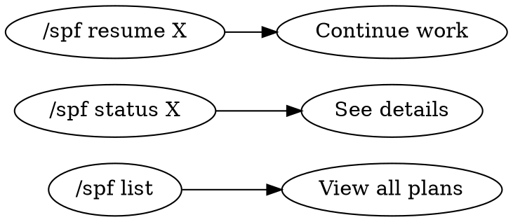

# Superpower-with-Files 🚀

**The ultimate unified AI workflow framework.**

Merges **persistent memory** from `planning-with-files` with **disciplined TDD execution** from `superpowers`. Features per-project memory isolation, automated upstream sync, and overlay-based skill customization.

---

## 📦 Features

| Feature                  | Description                                              |
| ------------------------ | -------------------------------------------------------- |
| **Persistent AI Memory** | Manus-style file logging - agents never "lose their spot" |
| **Dynamic TDD Loop**     | RED-GREEN-REFACTOR cycle built-in                        |
| **Per-Project Isolation** | Memory files organized by project, not mixed             |
| **Upstream Sync**        | One-command sync from source repos + auto versioning     |
| **Overlay System**       | Customize skills without forking                         |
| **Workspace Clutter Control** | All AI logs routed to `.superpower-with-files/`    |

---

## ⚡ Quick Start

Tell your agent:
> "Read and follow the installation instructions in: **`bootstrap.md`**"

---

## 🛠 Platform Support

| Platform       | Setup Method     | Documentation                                        |
| -------------- | ---------------- | ---------------------------------------------------- |
| Claude Code    | Native Plugin    | [.claude-plugin/plugin.json](./.claude-plugin/plugin.json) |
| Cursor         | Context Skills   | [.cursor/hooks.json](./.cursor/hooks.json)           |
| OpenCode       | Config Symlink   | [.opencode/INSTALL.md](./.opencode/INSTALL.md)       |
| OpenClaw       | Local/Global Skills | [.openclaw/INSTALL.md](./.openclaw/INSTALL.md)    |
| Codex          | Skills Discovery | [.codex/INSTALL.md](./.codex/INSTALL.md)             |
| Gemini CLI     | Skill Linking    | [.gemini-cli/INSTALL.md](./.gemini-cli/INSTALL.md)   |
| Aider / Cline  | Instruction Injection | [bootstrap.md](./bootstrap.md)                  |

---

## 📥 Installation

### Option 1: Claude Code Plugin (Recommended)

1. **Clone SPF to a central location:**
   ```bash
   git clone https://github.com/mok888/superpower-with-files ~/.spf
   ```

2. **Install the plugin:**
   ```bash
   mkdir -p ~/.claude/plugins
   ln -s ~/.spf/.claude-plugin ~/.claude/plugins/spf
   ```

3. **Link skills:**
   ```bash
   mkdir -p ~/.claude/skills
   for skill in ~/.spf/skills/*/; do
     ln -s "$skill" ~/.claude/skills/
   done
   ```

4. **Restart Claude Code**

### Option 2: Manual Installation (Any Platform)

1. **Clone the repository:**
   ```bash
   git clone https://github.com/mok888/superpower-with-files.git
   cd superpower-with-files
   ```

2. **Build unified skills:**
   ```bash
   ./.spf-core/scripts/build_unified.sh
   ```

3. **Link to your platform's skills directory:**

   | Platform     | Skills Location                  | Command                                           |
   | ------------ | -------------------------------- | ------------------------------------------------- |
   | Claude Code  | `~/.claude/skills/`              | `ln -s $(pwd)/skills/* ~/.claude/skills/`         |
   | Cursor       | `~/.cursor/skills/`              | `ln -s $(pwd)/skills/* ~/.cursor/skills/`         |
   | OpenCode     | `~/.config/opencode/skills/`     | `ln -s $(pwd)/skills/* ~/.config/opencode/skills/`|
   | OpenClaw     | `~/.openclaw/skills/`            | `ln -s $(pwd)/skills/* ~/.openclaw/skills/`       |

4. **Copy agent instructions to your project:**
   ```bash
   # For Claude Code
   cp -r .claude /path/to/your/project/
   
   # For Codex
   cp -r .codex /path/to/your/project/
   
   # For Cursor
   cp -r .cursor /path/to/your/project/
   ```

### Option 3: Project-Local (No Global Install)

1. **Add as submodule:**
   ```bash
   cd your-project
   git submodule add https://github.com/mok888/superpower-with-files.git .spf
   ```

2. **Build skills:**
   ```bash
   ./.spf/.spf-core/scripts/build_unified.sh
   ```

3. **Link locally:**
   ```bash
   mkdir -p .claude/skills
   ln -s ../.spf/skills/* .claude/skills/
   ```

---

## 📂 Repository Structure

```
.
├── .spf-core/                    # Core architecture
│   ├── vendor/                   # Raw upstream copies (DO NOT EDIT)
│   │   ├── superpowers/          # obra/superpowers
│   │   └── planning-with-files/  # OthmanAdi/planning-with-files
│   ├── overlays/                 # Custom modifications
│   │   └── superpowers/          # spf-*.md overlay files
│   ├── scripts/                  # Build + sync automation
│   │   ├── sync-upstream.sh      # Fetch latest upstreams
│   │   └── build_unified.sh      # Merge vendor + overlays
│   └── src/                      # Source assets
│       ├── hooks/                # Session hooks
│       ├── skill-templates/      # Stack templates
│       └── templates/            # Memory file templates
│
├── skills/                       # Unified skills (auto-generated)
│   ├── brainstorming/            # Design before implementation
│   ├── planning-with-files/      # Persistent memory system
│   ├── spf-write-plan/           # Plan creation (SPF branded)
│   ├── spf-exec-plan/            # Plan execution (SPF branded)
│   ├── test-driven-development/  # RED-GREEN-REFACTOR
│   ├── systematic-debugging/     # Root cause tracing
│   ├── using-git-worktrees/      # Feature isolation
│   └── ...                       # 15 skills total
│
├── hooks/                        # Session hooks
│   ├── check-complete.sh         # Completion verification
│   └── init-session.sh           # Session initialization
│
├── templates/                    # Memory file templates
│   ├── task_plan.md
│   ├── findings.md
│   └── progress.md
│
├── VERSION                       # Current SPF version
├── CHANGELOG.md                  # Auto-generated from upstreams
└── AGENTS.md                     # AI knowledge base
```

---

## 🧠 Per-Project Memory Isolation

### Path Resolution

```
Priority:
1. User-specified path (explicit in prompt)
2. .superpower-with-files/{project-name}/ (auto-detected)
3. .superpower-with-files/_current/ (fallback)
```

**Project name detection:** User prompt → CWD basename → Git remote → Package manifest

### Directory Structure

```
.superpower-with-files/
├── nautilus-trader/              # Project A
│   ├── task_plan.md              # High-level phases
│   ├── findings.md               # Research, decisions
│   ├── progress.md               # Session log
│   └── design/
│       └── 2025-03-07-auth.md    # Brainstorming outputs
│
├── quant-bot/                    # Project B
│   ├── task_plan.md
│   ├── findings.md
│   └── progress.md
│
└── _templates/                   # Starting templates
    ├── task_plan.md
    ├── findings.md
    └── progress.md
```

### Memory Files

| File                   | Purpose                           |
| ---------------------- | --------------------------------- |
| `task_plan.md`         | High-level phases and goal tracking |
| `active_tdd_plan.md`   | Granular, minute-by-minute steps  |
| `progress.md`          | Session log, test results, errors |
| `findings.md`          | Research, decisions, constraints  |
| `design/*.md`          | Brainstorming outputs             |

> [!IMPORTANT]
> **Strict Phase Separation**: Planning (thinking/designing) and Execution (doing/writing) are separate. Agent won't touch code until you give "Execute" command.

---

## 🎯 Skills Overview

### Core Workflow Skills

| Skill                        | Purpose                              | Trigger                              |
| ---------------------------- | ------------------------------------ | ------------------------------------ |
| `brainstorming`              | Design before implementation         | "How should I build X?"              |
| `spf-write-plan`             | Create implementation plan           | After design approved                |
| `spf-exec-plan`              | Execute plan step-by-step            | "Execute the plan"                   |
| `test-driven-development`    | RED-GREEN-REFACTOR cycle             | Before writing implementation        |
| `systematic-debugging`       | Root cause tracing                   | "Fix this bug"                       |

### Supporting Skills

| Skill                              | Purpose                         |
| ---------------------------------- | ------------------------------- |
| `using-git-worktrees`              | Feature isolation (REQUIRED)    |
| `using-superpowers`                | How to find/use skills          |
| `writing-skills`                   | TDD for documentation           |
| `requesting-code-review`           | Before merge                    |
| `receiving-code-review`            | Handle feedback                 |
| `finishing-a-development-branch`   | Merge/cleanup                   |
| `dispatching-parallel-agents`      | Background execution            |
| `subagent-driven-development`      | Delegate implementation         |
| `verification-before-completion`   | Evidence required               |

### Stack Templates

Located in `skills/spf-write-plan/templates/`:
- `python-cli.md` - Python CLI project
- `rust-axum.md` - Rust web service
- `react-component.md` - React component
- And more...

---

## 📋 Plan Management

Track, list, and resume plans across all projects.

### Commands

| Command                  | Action                          | Example                      |
| ------------------------ | ------------------------------- | ---------------------------- |
| `/spf list`              | List all plans with status      | `/spf list`                    |
| `/spf status <project>`  | Detailed plan status            | `/spf status nautilus-trader`  |
| `/spf resume <project>`  | Resume execution                | `/spf resume nautilus-trader`  |
| `/spf block <project>`   | Mark as blocked                 | `/spf block legacy-api`        |
| `/spf unblock <project>` | Remove blocked status           | `/spf unblock legacy-api`      |
| `/spf complete <project>`| Mark complete                   | `/spf complete quant-bot`      |
| `/spf archive <project>` | Move to archive                 | `/spf archive old-project`     |

### Plan Registry

Plans are tracked in `.superpower-with-files/_registry/PLANS.md`:

```markdown
| Project          | Goal                    | Status      | Phase | Tasks  | Updated    |
| ---------------- | ----------------------- | ----------- | ----- | ------ | ---------- |
| nautilus-trader  | Implement JWT auth      | in_progress | 3/5   | 12/25  | 2025-03-07 |
| quant-bot        | Add backtesting engine  | complete    | 5/5   | 30/30  | 2025-03-06 |
| legacy-api       | Migrate to v2           | blocked     | 2/4   | 8/20   | 2025-03-01 |
```

### Status Values

- `pending` - Plan created, not started
- `in_progress` - Currently executing
- `blocked` - Cannot proceed (needs external input)
- `complete` - All phases done

### Workflow



---

## 🔄 Upstream Sync Workflow

SPF tracks two upstream repositories:
- **superpowers** (obra/superpowers) - TDD execution framework
- **planning-with-files** (OthmanAdi/planning-with-files) - Persistent memory system

### Step 1: Fetch Latest Upstreams

```bash
./.spf-core/scripts/sync-upstream.sh
```

This:
1. Clones latest from both upstreams
2. Updates `.spf-core/vendor/` with fresh copies
3. **Bumps SPF version** (patch +1 in VERSION file)
4. **Updates CHANGELOG.md** with upstream release notes
5. Runs `build_unified.sh` to re-merge with overlays

### Step 2: Review Changes

```bash
git diff
```

### Step 3: Commit Updates

```bash
git add .
git commit -m "v0.1.1: sync upstream (superpowers 1.2.3, planning-with-files 2.0.1)"
git push
```

### Dry Run

```bash
./.spf-core/scripts/sync-upstream.sh --dry-run
```

### Version Management

| Component      | Behavior                                 |
| -------------- | ---------------------------------------- |
| `VERSION`      | Single source of truth, auto-bumped      |
| `CHANGELOG.md` | Auto-updated with upstream release notes |

---

## 🔧 Build System

### build_unified.sh

Merges vendor + overlays into unified skills:

```
1. Clean skills/, hooks/, templates/
2. Copy planning-with-files (memory system)
3. Copy superpowers (TDD execution)
4. Apply overlays (inject customizations)
5. Rename to SPF brand (spf-write-plan, spf-exec-plan)
6. Validate (YAML frontmatter checks)
```

### Validation Checks

- YAML frontmatter exists (`---...---`)
- `name:` field present
- `description:` field present
- Frontmatter properly closed

---

## 📝 Overlay System

Customize upstream skills without modifying vendor files.

### Overlay Format

```markdown
<!-- target: skills/target-skill/SKILL.md -->
<!-- action: append | overwrite -->

## Custom Section

Your additional rules here...
```

**Actions:**
- `append` - Add content to END of target file
- `overwrite` - Replace target file entirely

### Creating New Overlays

```bash
# 1. Create overlay file (use spf-* naming)
cat > .spf-core/overlays/superpowers/spf-my-skill.md << 'EOF'
<!-- target: skills/my-skill/SKILL.md -->
<!-- action: append -->

## Custom Section

Your additional rules here...
EOF

# 2. Rebuild
./.spf-core/scripts/build_unified.sh

# 3. Commit
git add . && git commit -m "overlay: add spf-my-skill"
```

### Current Overlays

| File                         | Target Skill             |
| ---------------------------- | ------------------------ |
| `spf-brainstorming.md`       | brainstorming            |
| `spf-planning-with-files.md` | planning-with-files      |
| `spf-receiving-review.md`    | receiving-code-review    |
| `spf-requesting-review.md`   | requesting-code-review   |
| `spf-using-superpowers.md`   | using-superpowers        |

---

## 📋 Hooks

| Hook               | Purpose                         |
| ------------------ | ------------------------------- |
| `check-complete.sh` | Verify task completion          |
| `init-session.sh`  | Initialize new session          |

---

## 📚 Documentation

| File          | Purpose                         |
| ------------- | ------------------------------- |
| `AGENTS.md`   | AI knowledge base (this repo)   |
| `bootstrap.md`| Installation instructions       |
| `CHANGELOG.md`| Version history                 |
| `VERSION`     | Current version number          |

---

## ⚠️ Anti-Patterns

- **NEVER** modify `.spf-core/vendor/` directly → use overlays
- **NEVER** skip `build_unified.sh` after overlay changes
- **NEVER** use `mod-*.md` naming → use `spf-*.md`
- **NEVER** commit to `skills/` without validation passing
- **NEVER** mix project contexts in same memory folder

---

## ❤️ Appreciation

- **[superpowers](https://github.com/obra/superpowers)** by @obra - TDD execution framework
- **[planning-with-files](https://github.com/OthmanAdi/planning-with-files)** by @OthmanAdi - Persistent memory system

---

## License

MIT
